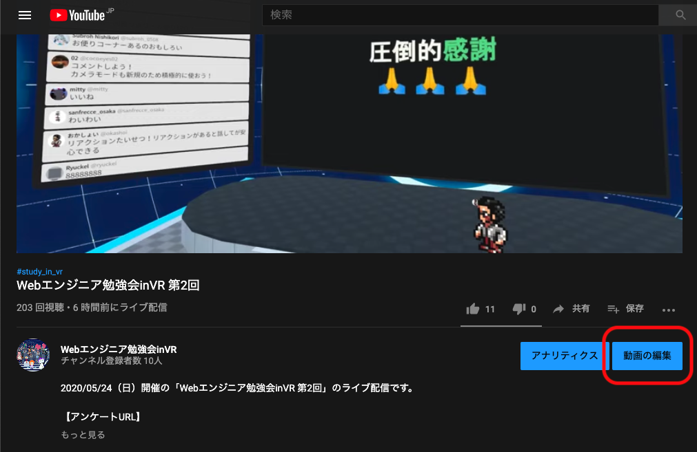
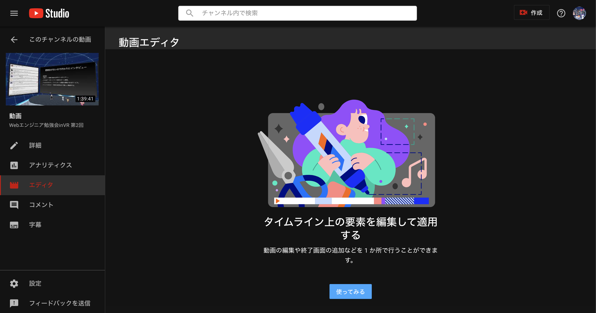
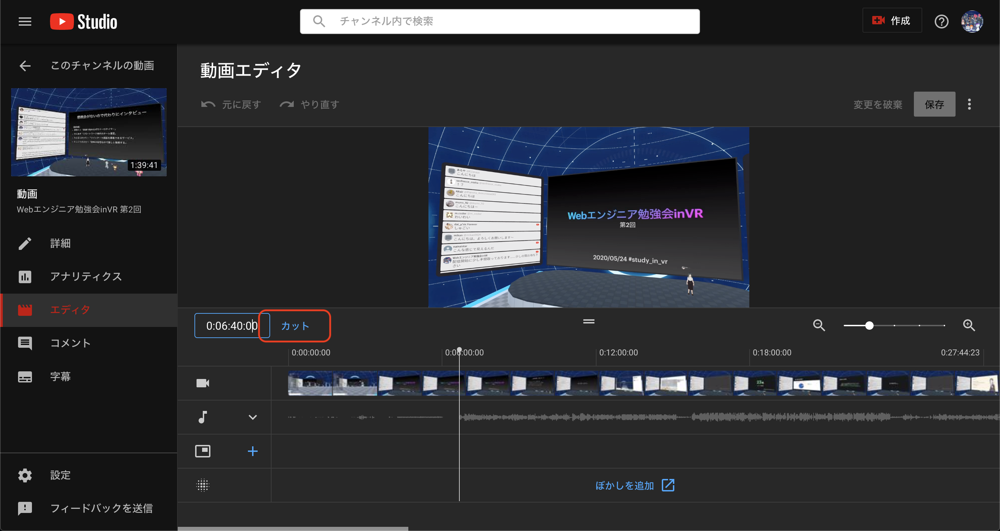
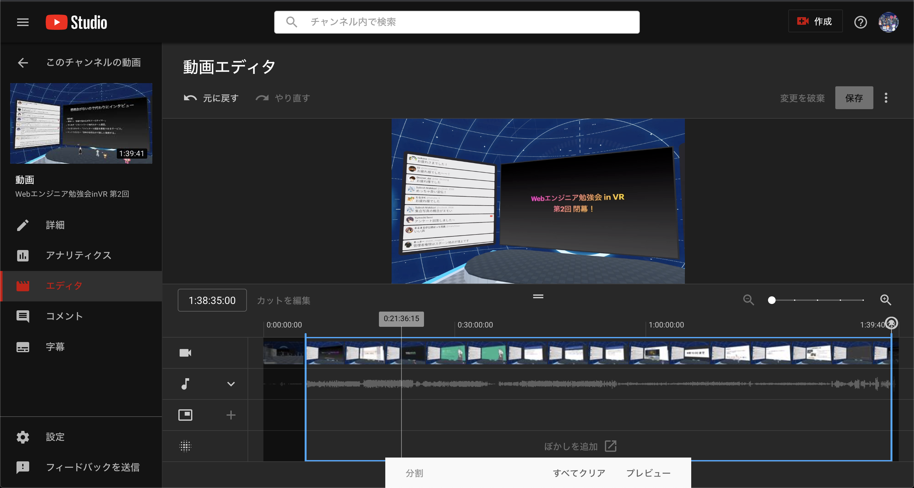
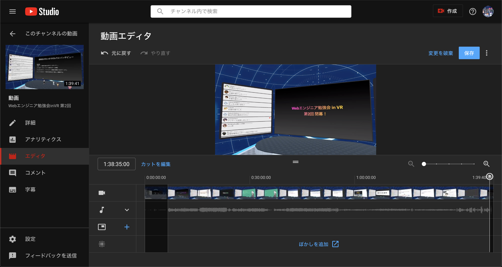
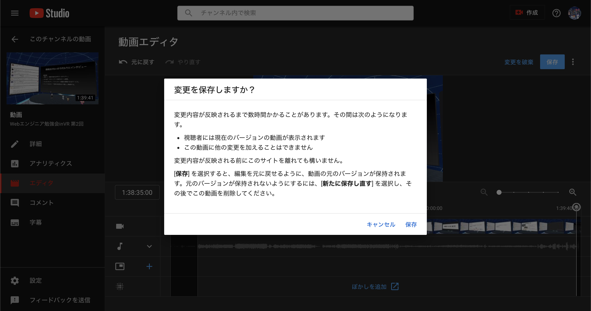

# YouTube に関する How to

## 動画の先頭・最後をカットする

[公式ドキュメント](https://support.google.com/youtube/answer/9057455?hl=ja&ref_topic=9257784)も参考のこと。

「動画の編集」ボタンからYouTube Studioに遷移する（導線は他にもいくつか存在する）。

 

サイドメニューの「エディタ」を選択して動画エディタを開く。

初めて開くときは以下のような画面が表示されるので「使ってみる」をクリックする。

下図の「カット」をクリックする。

画面下部に青い枠が表示されるので、左右の辺をドラッグして動かして任意の始点・終点を設定し、完了したら「プレビュー」をクリックする。

実際に動画を再生して確認できるので、切り取った範囲に問題がなければ「保存」をクリックする。

次のようなダイアログが表示されるので「保存」をクリックする。

### 注意点

動画をカットすると、ライブ配信のチャットは表示できなくなってしまう。

（参考）[チャットの基本 - YouTube ヘルプ](https://support.google.com/youtube/answer/2524549?hl=ja)

> 注: 動画エディタでカットされたライブ配信では、チャットのリプレイが表示されません。
